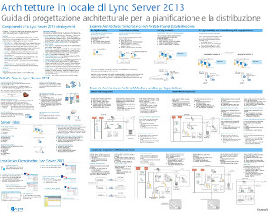
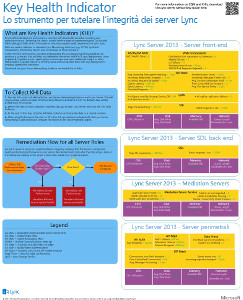
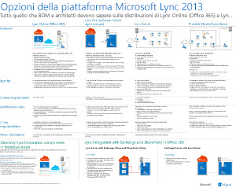
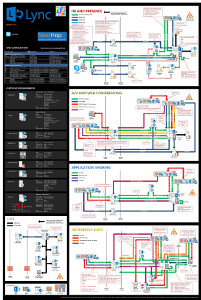

---
title: Diagrammi tecnici di Lync Server 2013
TOCTitle: Diagrammi tecnici
ms:assetid: 7b6da49b-ac72-4ab0-8957-166e330b38fa
ms:mtpsurl: https://technet.microsoft.com/it-it/library/Dn594589(v=OCS.15)
ms:contentKeyID: 61170914
ms.date: 08/24/2015
mtps_version: v=OCS.15
ms.translationtype: HT
---

# Diagrammi tecnici per Lync Server 2013

 

_**Ultima modifica dell'argomento:** 2015-03-09_

**Riepilogo:** in questi diagrammi sono rappresentate visivamente le soluzioni consigliate per Lync 2013.

Queste risorse sono disponibili in formato Visio (.vsd) (Visio 2010 o Visio 2013) e in formato PDF. Per informazioni su come stampare i documenti, vedere Suggerimenti per la stampa dei poster.

Per visualizzare questi file, potrebbe essere necessario software aggiuntivo. Per ulteriori informazioni, vedere la seguente tabella.

<table>
<colgroup>
<col style="width: 50%" />
<col style="width: 50%" />
</colgroup>
<thead>
<tr class="header">
<th>Tipo file</th>
<th>Software</th>
</tr>
</thead>
<tbody>
<tr class="odd">
<td>
.vsd
</td>
<td>
Visio 2010, Visio 2013 o il <a href="http://go.microsoft.com/fwlink/?linkid=393676">visualizzatore gratuito di Visio</a>

Se si utilizza il visualizzatore di Visio, fare clic con il pulsante destro del mouse sul collegamento VSD, scegliere <strong>Salva oggetto con nome</strong>, salvare il file nel computer in uso e quindi aprirlo dal computer stesso.
</td>
</tr>
<tr class="even">
<td>
.pdf
</td>
<td>
Qualsiasi visualizzatore PDF, ad esempio <a href="http://go.microsoft.com/fwlink/?linkid=393675">Adobe Reader</a>
</td>
</tr>
<tr class="odd">
<td>
.zip
</td>
<td>
Qualsiasi utilità di compressione file. In Windows 7 e 8 questi file vengono aperti in modalità nativa.
</td>
</tr>
</tbody>
</table>

## Poster

In questi poster è illustrata in dettaglio una specifica area tecnica. Utilizzarli congiuntamente agli articoli corrispondenti in TechNet o ai contenuti disponibili nell'Area download.

<table>
<colgroup>
<col style="width: 50%" />
<col style="width: 50%" />
</colgroup>
<thead>
<tr class="header">
<th>Titolo</th>
<th>Descrizione</th>
</tr>
</thead>
<tbody>
<tr class="odd">
<td>
<strong>Architetture locali di Lync Server 2013</strong>

<a href="http://go.microsoft.com/fwlink/?linkid=392974">Ingrandire il poster per visualizzarne i dettagli con Zoom.it di Microsoft</a> (visualizzazione ottimale su computer desktop o portatili)

<a href="http://go.microsoft.com/fwlink/?linkid=392578">Versione PDF</a> (visualizzazione ottimale per dispositivi mobili o tablet)

<a href="http://go.microsoft.com/fwlink/?linkid=392579">Versione Visio</a> (visualizzazione ottimale per utenti di Visio)
</td>
<td>
Questo poster include indicazioni utili relative all'architettura ai fini della pianificazione e della distribuzione. Contiene informazioni sui componenti comuni di Lync Server, sulla terminologia utilizzata per la pianificazione di una distribuzione, su nuove funzionalità e su ruoli server, oltre a una panoramica dell'installazione. Il poster contiene inoltre esempi di architetture per ottimizzare la disponibilità elevata e il ripristino di emergenza, oltre a varie topologie di esempio (piccole, medie e grandi dimensioni).

Dimensioni: 86,36x111,76 cm

Questo poster è stato creato con Visio 2013. Non dovrebbero essere necessarie modifiche per un ambiente specifico.
</td>
</tr>
<tr class="even">
<td>
<strong>Metodologia per il controllo della qualità delle chiamate Lync</strong>

<a href="http://go.microsoft.com/fwlink/?linkid=392972">Ingrandire il poster per visualizzarne i dettagli con Zoom.it di Microsoft</a> (visualizzazione ottimale su computer desktop o portatili)

<a href="http://go.microsoft.com/fwlink/?linkid=391841">Versioni Visio e PDF compresse in un file zip</a>
</td>
<td>
In questo poster viene illustrata la procedura di risoluzione dei problemi relativi al sistema Lync, in particolare di quelli che influiscono sulla qualità vocale in ambito aziendale. Utilizzarlo insieme a:

<ul>
<li>
<a href="http://go.microsoft.com/fwlink/p/?linkid=390677">Guida ai servizi di rete di Lync Server</a>
</li>
<li>
<a href="lync-server-2013-poster-lync-call-quality-methodology.md">Metodologia per il controllo della qualità delle chiamate Lync</a> (articolo adattato per utenti con disabilità)
</li>
<li>
<a href="lync-server-2013-poster-key-health-indicators.md">Indicatori chiave per l'integrità</a> (articolo adattato per utenti con disabilità)
</li>
</ul>

Dimensioni: 86,36x111,76 cm

Questo poster è stato creato con Visio 2010. Non dovrebbero essere necessarie modifiche per un ambiente specifico.
</td>
</tr>
<tr class="odd">
<td>
<strong>Indicatori chiave per l'integrità</strong>

<a href="http://go.microsoft.com/fwlink/?linkid=392971">Ingrandire il poster per visualizzarne i dettagli con Zoom.it di Microsoft</a> (visualizzazione ottimale su computer desktop o portatili)

<a href="http://go.microsoft.com/fwlink/?linkid=391838">Versioni Visio e PDF compresse in un file zip</a>
</td>
<td>
In questo poster vengono illustrate le metriche per la risoluzione dei problemi del server allo scopo di garantire l'integrità di base del server e di un ruolo del server specifico nell'implementazione di Lync. Utilizzarlo insieme a:

<ul>
<li>
<a href="http://go.microsoft.com/fwlink/p/?linkid=390677">Guida ai servizi di rete di Lync Server</a>
</li>
<li>
<a href="lync-server-2013-poster-lync-call-quality-methodology.md">Metodologia per il controllo della qualità delle chiamate Lync</a> (articolo adattato per utenti con disabilità)
</li>
<li>
<a href="lync-server-2013-poster-key-health-indicators.md">Indicatori chiave per l'integrità</a> (articolo adattato per utenti con disabilità)
</li>
</ul>

Dimensioni: 43,18x55,88 cm

Questo poster è stato creato con Visio 2010. Non dovrebbero essere necessarie modifiche per un ambiente specifico.
</td>
</tr>
<tr class="even">
<td>
<strong>Opzioni della piattaforma Lync 2013</strong>

<a href="http://go.microsoft.com/fwlink/p/?linkid=391840">Ingrandire il poster per visualizzarne i dettagli con Zoom.it di Microsoft</a>

<a href="http://go.microsoft.com/fwlink/p/?linkid=391837">Versione PDF</a> (visualizzazione ottimale per dispositivi mobili o tablet)

<a href="http://go.microsoft.com/fwlink/p/?linkid=391839">Versione Visio</a> (visualizzazione ottimale per utenti di Visio)
</td>
<td>
In questo poster vengono descritte le opzioni della piattaforma disponibili per Lync 2013 destinate a BDM e architetti. I clienti possono scegliere tra  Lync Online con Office 365, una soluzione Lync ibrida, Lync Server locale e una soluzione Lync ospitata. Il poster include i dettagli delle diverse opzioni, inclusi per ciascuno gli scenari ideali, i requisiti relativi alle licenze e le responsabilità dei professionisti IT.

Dimensioni: 86,36x111,76 cm

Questo poster è stato creato con Visio 2013. Non dovrebbero essere necessarie modifiche per un ambiente specifico.
</td>
</tr>
<tr class="odd">
<td>
<strong>Carichi di lavoro dei protocolli di Microsoft Lync Server 2013</strong>

<a href="http://go.microsoft.com/fwlink/?linkid=392970">Ingrandire il poster per visualizzarne i dettagli con Zoom.it di Microsoft</a>

<a href="http://go.microsoft.com/fwlink/?linkid=392512">Versione PDF</a> (visualizzazione ottimale per dispositivi mobili o tablet)

<a href="http://go.microsoft.com/fwlink/?linkid=392513">Versione Visio</a> (visualizzazione ottimale per utenti di Visio)
</td>
<td>
Scaricare questo poster per ottenere informazioni sulle funzionalità e sui requisiti di Lync 2013, Lync Phone, Lync Web App, Lync per Mac e Lync Mobile. Nel poster viene inoltre spiegato come utilizzare i carichi di lavoro di Lync Server per facilitare le comunicazioni nell'ambito dell'organizzazione.

Dimensioni: 60,96x91,44 cm

Questo poster è stato creato con Visio 2013. Non dovrebbero essere necessarie modifiche per un ambiente specifico.
</td>
</tr>
</tbody>
</table>

## Suggerimenti per la stampa dei poster

Se si dispone di un plotter, è possibile stampare questi poster con le dimensioni effettive. In caso contrario, utilizzare la procedura seguente per stamparli su carta di formato inferiore.

**Stampare poster su carta di formato inferiore**

1.  Aprire il poster in Visio.

2.  Fare clic su **Imposta pagina** dal menu **File**.

3.  Nella sezione **Formato carta stampante** della scheda **Imposta stampante** selezionare il formato carta su cui stampare.

4.  Nella sezione **Proporzioni** della scheda **Imposta stampante** fare clic su **Adatta a**, quindi immettere **1 foglio in larghezza per 1 foglio in lunghezza**.

5.  Nella scheda **Dimensioni** fare clic su **Adatta a contenuto del disegno**, quindi fare clic su **OK**.

6.  Scegliere **Stampa** dal menu **File**.

